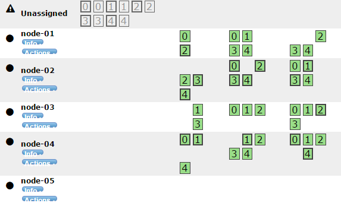

# Add New Node to Elasticsearch Cluster
---

## 目的
透過此篇文章，您可以學到以下內容：
* ES 版本更新
* 新增 node 加入既有的 ES 叢集(cluster)

## 參考文獻
* [Elasticsearch Ref-Upgrading](https://www.elastic.co/guide/en/elasticsearch/reference/current/setup-upgrade.html)
* [Elasticsearch Ref-Rolling Upgrades](https://www.elastic.co/guide/en/elasticsearch/reference/current/rolling-upgrades.html)


## 版本資訊
* OS：CentOS 6.7
* JAVA：JDK 8u77
* ES-node05(預加入叢集的 node)：2.3.1
* ES-cluster:2.3.4

## 問題需求
如下圖ES叢集架構
1. 預將 node05 版本更新至 2.3.4，與叢集版本相同。
2. 預將 node05 加入叢集中(叢集包含 master,node01,node02,node03,node04)
3. 叢集內的 index 資料與 node05 內資料不同，預保留兩方資料。

```bash
                   +--------+
                   | master |
                   +----+---+
                        |
    +---------+---------+---------+
    |         |         |         |
+---+--+  +---+--+  +---+--+  +---+--+  +------+
|node01|  |node02|  |node03|  |node04|  |node05|
+------+  +------+  +------+  +------+  +------+
```

## 解決方法概念
本文章參考 [Elasticsearch Ref-Rolling Upgrades](https://www.elastic.co/guide/en/elasticsearch/reference/current/rolling-upgrades.html) 內容，步驟過程將設定 node05 加入叢集中，概要步驟如下：
1. Disable shard allocation
2. Stop non-essential indexing and perform a synced flush
3. Stop and upgrade a single node(node05)
	1. Download new ES version
	2. Copy ./data file
	3. Setting ./config and ./bin file
	4. Install ES plugin
4. Start the upgrades node(node5)
5. Reenable shard allocation
6. Wait for the node to recover

## 解決方法細節
### 1. Disable shard allocation
因叢集偵測到 shard 有損壞或遺失會嘗試從既有的 shard 資料中補強並回復資料，此步驟是希望在 node05 加入至叢集過程中鎖定 shard，不做自動資料分配，避免導致額外的系統忙碌或錯誤發生，相關設定如下所示：

```bash
[es@ELK_Demo]$ curl -XPUT 'http://yourelasticsearch:9200/_cluster/settings' -d '{
  "transient": {
    "cluster.routing.allocation.enable": "none"
  }
}'
```

### 2. Stop non-essential indexing and perform a synced flush
讓 shard 資料不再變動，確認叢集中各個 shard 完成資料同步，相關設定如下：

```bash
[es@ELK_Demo]$curl -XPOST 'http://yourelasticsearch:9200/_flush/synced'
```

### 3. Stop and upgrade a single node
將 node05 做版本更新並加入至叢集中，相關步驟與設定如下：

#####	3.1. Download new ES version
下載預更新版本並解壓縮

```bash
[es@ELK_Demo]$ wget https://download.elastic.co/elasticsearch/release/org/elasticsearch/distribution/tar/elasticsearch/2.3.4/elasticsearch-2.3.4.tar.gz
[es@ELK_Demo]$ tar zxvf elasticsearch-2.3.4.tar.gz
[es@ELK_Demo]$ ls elasticsearch-2.3.4
bin	LICENSE.txt	modules	config	lib	NOTICE.txt	README.textile
```

#####	3.2. Copy ./data file
可以發現新版資料夾內未有 ./data 資料夾，因希望保留 node05 上所有資料，因此直接複製既有的 ./data 至新版資料夾上，設定如下：

```bash
[es@ELK_Demo]$ cp -r ./elasticsearch-2.3.1/data ./elasticsearch-2.3.4
```

#####	3.3. Setting ./config file
叢集內的資料 node，設定檔需盡量保持一致，因此於 node05 新版本設定檔中相關參數設定如下：

```bash
[es@ELK_Demo]$ vim ./elasticsearch-2.3.4/config/elasticsearch.yml
...
cluster.name: my-cluster	#設定叢集名稱
node.name: node05			#設定 node 名稱
node.master: false			#node05 非叢集 master
node.data: true				#node05 為叢集 data node
network.host: 0.0.0.0		#node05 網路設定
http.port: 9200				#node05 ES 運行 port
discovery.zen.ping.unicast.hosts: ["10.10.10.10"]	#master IP
discovery.zen.minimum_master_nodes: 1	# 至少需發現多少叢集 master 數量
...

[es@ELK_Demo]$ vim ./elasticsearch-2.3.4/bin/elasticsearch
...
#設定 ES 使用記憶體大小
ES_MIN_MEM=8g
ES_MAX_MEM=8g
...
```

#####	3.4. Install ES plugin
安裝 ES 需要的 plugin，plugin 需求因人而異。

### 4. Start the upgrades node
重啟 ES node05，啟動設定如下：

```bash
[es@ELK_Demo]$ ./elasticsearch-2.3.4/bin/elasticsearch
...
[2016-08-03 12:30:49,250][INFO ][node                     ] [node05] initialized
[2016-08-03 12:30:49,250][INFO ][node                     ] [node05] starting ...
[2016-08-03 12:30:49,419][INFO ][transport                ] [node05] publish_address , bound_addresses {[::]:9301}
[2016-08-03 12:30:49,426][INFO ][discovery                ] [node05] ai-tree
[2016-08-03 12:30:52,598][INFO ][cluster.service          ] [node05] detected_master {node-master}{data=false, master=true}, added {{node03}{master=false},{node02}{master=false},{node-master}{data=false, master=true},{node04}{master=false},{node01}{master=false},}, reason: zen-disco-receive(from master [{node-master}{data=false, master=true}])
[2016-08-03 12:30:52,635][INFO ][cluster.routing.allocation.decider] [node05] updating [cluster.routing.allocation.enable] from [ALL] to [NONE]
[2016-08-03 12:30:52,892][INFO ][http] [node05] publish_address , bound_addresses {[::]:9200}
[2016-08-03 12:30:52,893][INFO ][node] [node05] started
...
```

會發現叢集中已加入 node05，但 shard 尚未自動分配，如下圖所示：



### 5. Reenable shard allocation
解鎖 shard 自動分配設定，讓各 index 資料同步，設定如下：

```bash
[es@ELK_Demo]$ curl -XPUT 'http://yourelasticsearch:9200/_cluster/settings' -d '{
  "transient": {
    "cluster.routing.allocation.enable": "all"
  }
}'
```

### 6. Wait for the node to recover
等待叢集資料分配完成，可利用 [ES-head Plugin](https://mobz.github.io/elasticsearch-head/) 觀看目前資料同步進度，或使用指令查看：

```bash
# 查看叢集健康狀態
[es@ELK_Demo]$ curl -XGET 'http://yourelasticsearch:9200/_cat/health'
# 查看各 index 與 shard 同步狀態 
[es@ELK_Demo]$ curl -XGET 'http://yourelasticsearch:9200/_cat/recovery'
```

同步完成結果如下，可發現原本 node05 的 index 資料已分布於各個 node 中。


### 問題與討論
1. 因原叢集有安裝 [Graph](https://www.elastic.co/products/graph)，其叢集各 ES node 已安裝 license plugin 與 graph plugin，詳情請見 [Graph安裝步驟](https://www.elastic.co/downloads/graph)。而 node05 未安裝相關套件，因此會造成啟動錯誤，錯誤訊息如下：

```bash
[es@ELK_Demo]$ ./elasticsearch-2.3.4/bin/elasticsearch
...
[2016-08-02 12:29:11,742][INFO ][discovery.zen] [node05] failed to send join request to master [{node-master}{data=false, master=true}], reason [RemoteTransportException[[node-master][internal:discovery/zen/join]]; nested: IllegalStateException[failure when sending a validation request to node]; nested: RemoteTransportException[[node05][internal:discovery/zen/join/validate]]; nested: IllegalArgumentException[No custom metadata prototype registered for type [licenses], node like missing plugins]; ]
[2016-08-02 12:29:12,209][INFO ][node] [node05] stopping
...
```

後續安裝 ES license plugin 與 graph plugin 已順利解決問題